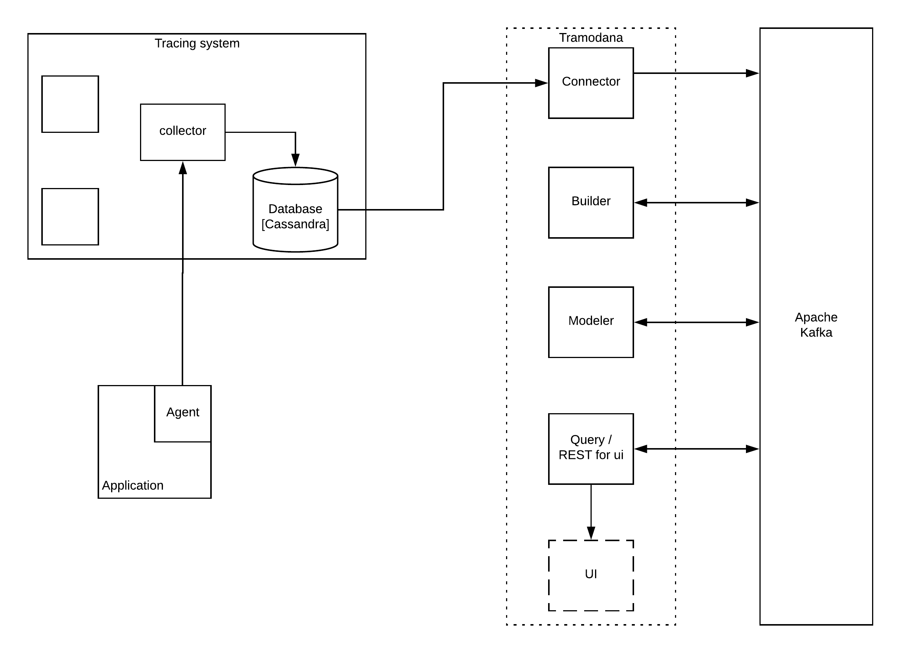

# Tramodana

Trace Modeling and Analysis - 
eliminate common maintenance issues by providing the ability to visualize and troubleshoot a distributed system.


## Description
Proof of concept to demonstrate visualization of a backend system out of trace data.
## Architecture

#### Connector 
Import data from a target system to Kafka and serves as the layer between Cassandra and Kafka.
Based on [Alpakka](https://github.com/akka/alpakka) and reactive streams.
#### Builder
Build sets of suggested models from traces. 
Based on [Kafka-streams API](https://kafka.apache.org/documentation/streams/).
#### Modeler
Convert SpanTrees into a BPMN 2.0 flowchart diagram in Bpmn format.
Based on Kafka-streams API and [Camunda](https://camunda.com/).
#### Query
Provide opportunity to query specific topics in Kafka via HTTP. 
Based on Kafka-streams API and [akka-http](https://github.com/akka/akka-http)

## How to use it?
REQUIREMENTS: 
* [Docker](https://docs.docker.com/install/)  
* [docker-compose](https://docs.docker.com/compose/install/)

#### 1. Generate example trace data
1. `docker-compose -f jaeger.yml up -d`
2. Check status `docker-compose -f jaeger.yml ps`  
Query, Agent and Collector containers should be UP
3. Build project TraceGenApp2 `./mvnw clean package` 
5. Run one `java -jar one/target/one.jar`
6. Run two `java -jar two/target/two.jar`
7. Several times `curl http://localhost:10081/buybook`
8. Check [localhost:16686](http://localhost:16686/)

#### 2. Run Tramodana
1. Build project `./gradlew clean installDist`
2. Up kafka-cluster, Builder and Modeler `docker-compose up -d`
3. Run connector to import traces `docker-compose -f connector_tramodana.yml up`
4. Open [localhost:3030](http://localhost:3030)
5. Find topic `spans-json-original` (all imported data in json format)
6. Find topic `root-operation-bpmn-xml` (camunda diagram)
7. `TODO` Query module


## Cassandra data samples
[Cassandra docker images docs](https://hub.docker.com/_/cassandra/).
Samples contains snapshot of cassandra db, with 3 traces from [Jorge's project](https://github.com/jeqo/poc-opentrancing-jvm)
1. Exec: `docker-compose -f jaeger.yml exec tracing-jaeger-cassandra cqlsh` 
2. Query DB with:

```mysql
DESCRIBE KEYSPACES;
USE jaeger_v1_dc1;
DESCRIBE TABLES;
SELECT * FROM traces;
```

## Connector
Check [connector documentation](./cassandra/connector.md) and [db entities](./cassandra/entities.md)
