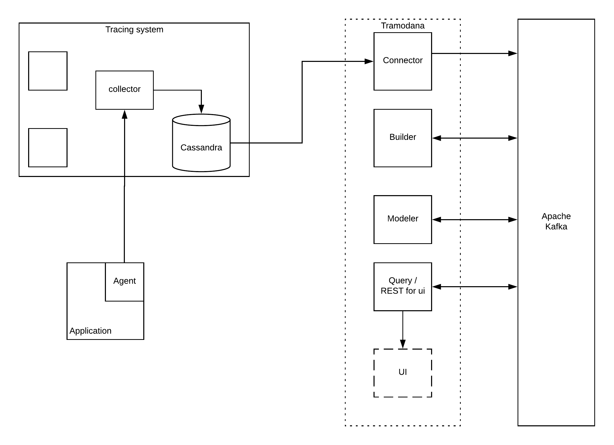

# Tramodana

Trace Modeling and Analysis - 
eliminate common maintenance issues by providing the ability to visualize and troubleshoot a distributed system.


## Description
Proof of concept to demonstrate visualization of a backend system out of trace data.
## Architecture

#### Connector 
Import data from a target system to Kafka and serves as the layer between Cassandra and Kafka.
Based on [Alpakka](https://github.com/akka/alpakka) and reactive streams.
#### Builder
Build sets of suggested models from traces. 
Based on [Kafka-streams API](https://kafka.apache.org/documentation/streams/).
#### Modeler
Convert SpanTrees into a BPMN 2.0 flowchart diagram in Bpmn format.
Based on Kafka-streams API and [Camunda](https://camunda.com/).
#### Query
Provide opportunity to query specific topics in Kafka via HTTP. 
Based on Kafka-streams API and [akka-http](https://github.com/akka/akka-http)

## How to use it?
REQUIREMENTS: 
* [Docker](https://docs.docker.com/install/)  
* [docker-compose](https://docs.docker.com/compose/install/)

#### 1. Generate example trace data
1. `docker-compose -f jaeger.yml up -d`
2. Check status `docker-compose -f jaeger.yml ps`  
Query, Agent and Collector containers should be UP
3. 


## running the application
### UP jaeger environment
1. `docker-compose -f jaeger.yml up -d`  
2. Check containers status with `docker-compose -f jaeger.yml ps` that both **tracing-jaeger-query** and **tracing-jaeger-collector** have the `Up` state. 

### UP kafka environment
3. Up Kafka with `docker-compose -f kafka.yml up -d`, takes around 2-3 mins
### UP generator app
4. Generate traces with examples/[TraceGenApp1](https://github.com/NikitaZhevnitskiy/TraceGenApp1) 
or examples/[TraceGenApp2](https://github.com/NikitaZhevnitskiy/TraceGenApp2)
### UP application TRAMODANA
5. Run ConnectorApp
6. Check [localhost:3030](http://localhost:3030)
7. Run Builder
8. Run Modeler


## Mock backend (todo: remove)
Install [json-server](https://github.com/typicode/json-server)
1. Exec `json-server models.json --port 3004`
2. Check [https://localhost:3004](https://localhost:3004)

## Cassandra data samples
[Cassanra docker images docs](https://hub.docker.com/_/cassandra/).
Samples contains snapshot of cassandra db, with 3 traces from [Jorge's project](https://github.com/jeqo/poc-opentrancing-jvm)
Make sure that docker user has permissions r/w/e to folder ./cassandra/data-sample: `chmod -R 777 /cassandra`
1. Exec: `docker run --name cassandra-test-db -p9042:9042 -v "$(pwd)"/cassandra/cassandra:/var/lib/cassandra -d cassandra:3.9` 
2. Exec CQLSH inside container: `docker exec -it <container_id> cqlsh`
3. Query DB with:

```mysql
DESCRIBE KEYSPACES;
USE jaeger_v1_dc1;
DESCRIBE TABLES;
SELECT * FROM traces;
```

## Connector
Check [connector documentation](./cassandra/connector.md) and [db entities](./cassandra/entities.md)

`docker run --rm -it --net=host`
